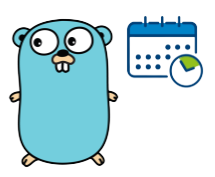

# Gows

Gows is an easy and super lightweight workflow management tool.
There is no need for setting up databases and web applications, Gows only takes a couples of json configuration files and that is it.
It is all that it takes to define your workflow DAGs.
