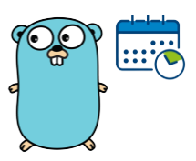
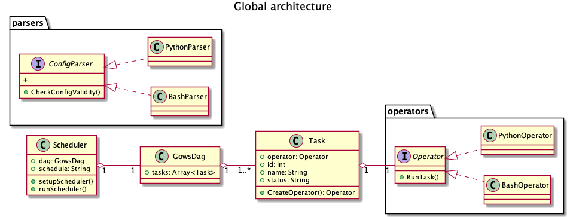

# Gows



[](https://github.com/Software-Craft-Factory/Gows/actions/workflows/go.yml)

Gows is an easy and super lightweight workflow management tool.
There is no need for setting up databases and web applications, Gows only takes a couples of json configuration files and that is it.
It is all that it takes to define your workflow DAGs.

## Documentation

### DAG
#### Create DAG
```console
gows create-dag -n my-new-dag
```
#### Visualize DAG
```console
gows show-dag -n my-new-dag
```
#### Get DAG status
```console
gows status-dag -n my-new-dag
```

### Task
#### Add Task to a DAG
```console
gows add-task -n my-new-dag
```
#### Add dependency to a Task
```console
gows add-dependency -n my-new-dag
```
### Manual JSON configuration

## Gows Architecture

